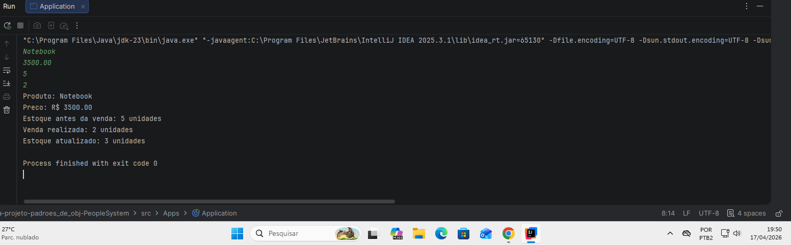

# 📦 Sistema de Controle de Estoque em Java

Aplicação de console desenvolvida em **Java** com foco em simular um fluxo básico de controle de estoque, incluindo cadastro de produto, validação de venda e atualização de inventário.

---

## 🚀 Objetivo

Demonstrar conceitos fundamentais de:

* Programação orientada a objetos (POO)
* Encapsulamento de dados
* Regras de negócio aplicadas
* Interação via terminal (entrada/saída)

---

## ⚙️ Funcionalidades

* Cadastro de produto:

  * Nome
  * Preço
  * Quantidade inicial em estoque
* Processamento de venda
* Validação de estoque disponível
* Atualização automática do estoque
* Exibição dos dados antes e depois da venda

---

## 🧱 Estrutura do Projeto

```text
src/
├── Apps/
│   └── Application.java   # Classe principal (execução)
└── PeopleSystem/
    └── Produto.java      # Regra de negócio e entidade Produto
```

---

## ▶️ Como Executar

### 1. Compilar o projeto

```bash
javac src/PeopleSystem/Produto.java src/Apps/Application.java
```

### 2. Executar a aplicação

```bash
java -cp src Apps.Application
```

---

## 💻 Exemplo de Execução

### Entrada:

```text
Notebook
3500.00
5
2
```

### Saída:

```text
Produto: Notebook
Preco: R$ 3500.00
Estoque antes da venda: 5 unidades
Venda realizada: 2 unidades
Estoque atualizado: 3 unidades
```

---

## 📸 Demonstração



---

## 📏 Regras de Negócio

* A venda só é realizada se houver estoque suficiente.
* Caso contrário, o sistema exibe:

```text
Estoque insuficiente para realizar a venda.
```

* O estoque permanece inalterado em caso de erro.

---

## 🧠 Conceitos Aplicados

* Programação Orientada a Objetos (POO)
* Separação de responsabilidades
* Validação de regras de negócio
* Estruturação de projeto em camadas simples


